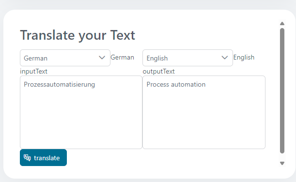

# google-translate-connector

Say goodbye to language barriers in process automation. Our connector to the Google Translate translation service enables you to a quick integration by providing a demo implementation.

This connector

- is based on the Google REST API specification.
- translates text and HTML files.


## Demo

Translates text entered by the user via a simple API:



## Setup

- Please access "Google Developers Console" page at http://code.google.com/apis/console.
- Use your Google Account to order an API key
- Copy the API-Key of your account into

`config/variables.yaml` under
`variables.google-translate-connector.apiKey`

```
@variables.yaml@
```
